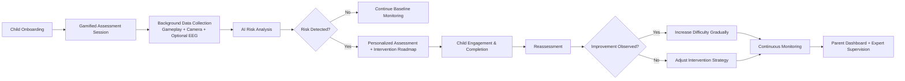

# 🧠 NeuroBloom

> **AI-powered, gamified early learning-disability screening and intervention support platform** for children.

NeuroBloom is a multimodal assessment platform that combines **gameplay behavior**, **camera-based observation**, and optional **EEG signals** to identify early risk patterns associated with learning difficulties (such as dyslexia, dyscalculia, dysgraphia, and attention-related challenges). The platform then transforms risk insights into **personalized, child-friendly intervention pathways** with parent and expert involvement.

---

## Table of Contents

- [Vision and USP](#vision-and-usp)
- [Problem We Solve](#problem-we-solve)
- [What NeuroBloom Delivers](#what-neurobloom-delivers)
- [How the Platform Works](#how-the-platform-works)
- [System Architecture](#system-architecture)
- [Detection Domains Covered](#detection-domains-covered)
- [Core Features](#core-features)
- [Use Cases](#use-cases)
- [Feasibility and Deployment Readiness](#feasibility-and-deployment-readiness)
- [Tech Stack](#tech-stack)
- [Repository Structure](#repository-structure)
- [Environment Variables](#environment-variables)
- [Local Development Setup](#local-development-setup)
- [API Overview](#api-overview)
- [Data and Privacy Principles](#data-and-privacy-principles)
- [Roadmap Suggestions](#roadmap-suggestions)
- [Troubleshooting](#troubleshooting)

---

## Vision and USP

### Vision
NeuroBloom aims to make early learning support **engaging, low-stress, and accessible** by replacing exam-like screening with **interactive game-based experiences**.

### Unique Selling Proposition
- ✅ **100% Gamified detection + therapy support path** (no stressful exam format)
- ✅ **Multi-disability support in one platform**
- ✅ **AI + expert-guided intervention loop**
- ✅ **Adaptive learning with continuous progress tracking**
- ✅ **Ethical, child-first, parent-centric design**

---

## Problem We Solve

Traditional learning-disability detection often happens late, after school performance drops significantly. NeuroBloom addresses this by:

- Detecting risk indicators early through natural child interaction.
- Combining multiple evidence channels (games + behavior + optional EEG).
- Providing practical, personalized next-step recommendations.
- Involving parents and experts continuously, not only after failure.

---

## What NeuroBloom Delivers

1. **Early Detection + Intervention Trigger**
2. **Fully Gamified Assessment Flow**
3. **AI-Based Multi-Disability Risk Screening**
4. **Behavior & Gameplay Analytics** (attention, reaction speed, engagement patterns)
5. **Personalized Support Courses** with progressive adjustments
6. **Expert-Guided Oversight** by psychologists/educators
7. **Parent Dashboard-Led Monitoring**
8. **Adaptive, Ethical, Consent-Centric Improvement Loop**

---

## How the Platform Works

### End-to-End Workflow



### Operational Model

- **Stage 1 (Primary):** Hardware-light screening using games + camera.
- **Stage 2 (Secondary):** Optional EEG-enhanced analysis for deeper cognitive signal quality in higher-risk or special-study cases.

---

## System Architecture

NeuroBloom follows a multimodal AI pipeline:

1. **Data Ingestion**
   - Gameplay telemetry (accuracy, reaction time, attempts)
   - Webcam-derived behavioral cues (face/attention/head movement)
   - Optional EEG signals (attention/fatigue trends)

2. **Temporal Synchronization Layer**
   - Aligns events from all channels on a common timeline.

3. **Feature Engineering Layer**
   - Converts raw events into model-ready features.

4. **Artifact Rejection and Data Quality Filtering**
   - Removes unreliable portions (e.g., noisy visual/EEG windows).

5. **Task-Specific Classifiers**
   - Reading, writing, numeracy, auditory/visual attention, etc.

6. **Clinical-Style Composite Report Generator**
   - Summarizes global risk profile, strengths, and concern areas.

7. **Personalized Recovery Planning**
   - Disability-specific recommendations in a gamified progression format.

---

## Detection Domains Covered

Current implementation and design direction support risk analytics for:

- **Dyscalculia** (numeracy pattern and processing behavior)
- **Reading disability / dyslexia-risk indicators**
- **Dysgraphia-risk indicators** (including handwriting signals)
- **Attention and impulsivity patterns** (behavior + optional EEG)
- **Emotion/engagement patterns** useful for intervention tuning

> ⚠️ NeuroBloom is designed as a **screening and support system**, not a standalone medical diagnostic authority.

---

## Core Features

### Child Experience
- Engaging gamified tasks instead of formal tests
- Stress-reduced interaction design
- Progressive/adaptive difficulty

### AI and Analytics
- Multimodal fusion across behavior, gameplay, and optional EEG
- Domain-specific prediction endpoints
- Risk categories + confidence-style outputs

### Reporting
- Session-linked report generation
- Personalized recommendations
- Parent-friendly summaries

### Parent and Expert Layer
- Parent dashboard for ongoing status and guidance
- Expert review and intervention supervision loop

### Platform Scalability
- Works with common hardware (laptop/tablet + webcam)
- Optional add-on EEG support for advanced scenarios

---

## Use Cases

1. **Early school-readiness and learning-risk screening**
2. **Personalized recovery plans for detected children**
3. **At-home guided assessment and monitoring**
4. **School-assisted support workflows**
5. **Expert-supervised remote child development support**
6. **Longitudinal progress tracking**
7. **Parent awareness and action guidance**
8. **Research-ready anonymized trend analytics (with policy controls)**

---

## Feasibility and Deployment Readiness

- **Technologically feasible:** built on practical web, CV, and ML tooling.
- **Practically deployable:** supports common consumer devices.
- **Clinically responsible direction:** intended for expert-assisted screening.
- **Scalable and cost-aware:** modular, staged architecture.
- **User acceptable:** game-based approach improves participation and retention.

---

## Tech Stack

### Frontend (`/neurobloom`)
- Next.js (App Router)
- React + TypeScript
- Tailwind-based UI + Radix primitives

### Backend (`/flask_backend`)
- Flask API services
- Python ML/processing stack (NumPy, pandas, scikit-learn, OpenCV, etc.)
- PDF generation and cloud upload integration

### Database
- PostgreSQL (local via Docker Compose)

### Integrations
- Cloudinary (asset/report uploads)
- GROQ API (LLM-assisted reporting workflow)
- Optional EEG workflow hooks

---

## Repository Structure

```text
NeuroBloom_Morphous/
├── README.md
├── docker-compose.yml
├── postgres-init/
│   └── init.sql
├── flask_backend/
│   ├── app.py
│   ├── worker.py
│   ├── requirements.txt
│   ├── utils/
│   └── ...
└── neurobloom/
    ├── app/
    ├── components/
    ├── hooks/
    ├── lib/
    ├── package.json
    └── ...
```

---

## Environment Variables

Create the following environment files before starting the app.

### 1) Backend: `flask_backend/.env`

```env
NEON_DB_URL=''
GROQ_API_KEY=
CLOUDINARY_CLOUD_NAME=
CLOUDINARY_API_KEY=
CLOUDINARY_API_SECRET=
```

### 2) Frontend: `neurobloom/.env`

```env
JWT_SECRET=
DATABASE_URL=''
CLOUDINARY_CLOUD_NAME=
CLOUDINARY_API_KEY=
CLOUDINARY_API_SECRET=
```

---

## Local Development Setup

### Prerequisites
- Node.js 18+
- Python 3.10+
- pip
- Docker + Docker Compose (for PostgreSQL)

### Step-by-step

1. **Start PostgreSQL**

```bash
docker compose up -d
```

2. **Install frontend dependencies**

```bash
cd neurobloom
npm install
```

3. **Start frontend**

```bash
npm run dev
```

4. **Install backend dependencies**

```bash
cd ../flask_backend
pip install -r requirements.txt
```

5. **Start backend API**

```bash
python app.py
```

6. **(Optional) Start background worker**

```bash
python worker.py
```

---

## API Overview

Main Flask prediction endpoints (from `flask_backend/app.py`):

- `POST /predict/dyscalculia`
- `POST /predict/reading_disability`
- `POST /predict/emotion`
- `POST /predict/test6`
- `POST /predict/handwriting`
- `POST /predict/test5`
- `POST /predict/video_analysis`
- `POST /predict/eeg`
- `POST /predict/full_report`
- `GET /health`

Most prediction endpoints expect a `session_id` and fetch associated session artifacts from storage/DB.

---

## Data and Privacy Principles

NeuroBloom should be operated with strict child-data safeguards:

- Explicit parent/guardian consent
- Minimal data collection and purpose limitation
- Role-based access for experts and admins
- Secure storage and transport practices
- Anonymization for analytics/research workflows
- Clear retention and deletion policies

---

## Roadmap Suggestions

- Add calibration and confidence explanation layer for parents
- Expand multilingual therapeutic content paths
- Introduce bias/fairness monitoring dashboards
- Provide federated/on-device analysis for privacy-sensitive deployments
- Integrate expert annotation feedback directly into retraining loops

---

## Troubleshooting

- **Frontend cannot connect to backend:** verify API URL configuration and backend port availability.
- **Session/report generation fails:** ensure DB connection string and Cloudinary credentials are valid.
- **Prediction endpoints return missing session errors:** confirm session creation/upload flow has completed before inference.
- **Audio/video feature extraction errors:** check file accessibility and supported media format.

---

## Disclaimer

NeuroBloom is a decision-support and early-screening platform for educational and developmental contexts. It does **not** replace formal clinical diagnosis. Final interpretation should involve qualified professionals.
